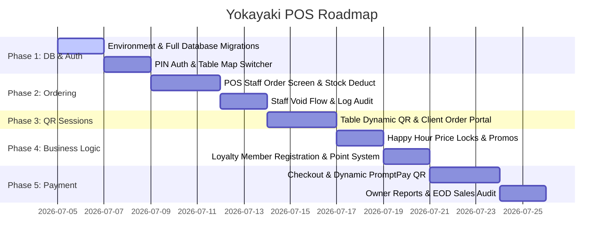

# Yokayaki POS Master Implementation Plan

แผนงานพัฒนาหลักระบบ POS ไฮบริดร้าน Yokayaki Izakaya ซึ่งได้รับการเรียงลำดับขั้นตอนตามตรรกะวิศวกรรมซอฟต์แวร์จริงเพื่อประสิทธิภาพสูงสุด (Database First ➡️ Core System ➡️ Business Modules ➡️ Payments & Dashboards)

---

## 📅 ลำดับขั้นตอนการพัฒนา (Development Milestones)

---

## รายละเอียดแต่ละขั้นตอน (Milestones & Action Items)

### 📌 เฟสที่ 1: โครงสร้างฐานข้อมูล & ระบบสิทธิ์พนักงาน (Core Foundation & Security)
**เป้าหมาย:** จัดเตรียมสภาพแวดล้อมให้เชื่อมต่อ Supabase จริง และรันตารางทั้งหมดของระบบในคราวเดียว เพื่อให้โครงสร้างข้อมูลนิ่ง ไม่เกิดการแก้ Database ซ้ำซากระหว่างเขียนส่วนหน้าจอ

*   **Task 1.1: อัปเดตตารางฐานข้อมูลทั้งหมด (All Schema Migrations)**
    *   เขียน SQL Migration สร้างตารางครบชุด: `employees`, `tables`, `qr_sessions`, `menu_items`, `orders`, `order_items`, `void_logs`, `loyalty_members`, `payments`
    *   ใส่ข้อมูลเมนูจำลองและไอดีพนักงานเริ่มต้น
*   **Task 1.2: คอนฟิกสภาพแวดล้อมและการเชื่อมต่อ (Supabase Client Setup)**
    *   นำเข้าคีย์จริงจาก `.env.local` เพื่อติดต่อฐานข้อมูล Supabase
*   **Task 1.3: ระบบระบุตัวตนพนักงาน (PIN Auth & Switcher)**
    *   สลักชุดรหัส PIN 6 หลักสำหรับ Owner (`111111`) และ Staff (`222222`)
    *   ทำระบบ Auto-Lock ล็อกเอาต์อัตโนมัติภายใน 5 นาที เพื่อรักษาความลับเมื่อพนักงานละเครื่อง

---

### 📌 เฟสที่ 2: ระบบสั่งอาหาร & จัดการสต็อก (Ordering & Stock Management)
**เป้าหมาย:** พนักงานหน้าร้านสามารถใช้แท็บเล็ตสั่งอาหารและหักสต็อกได้แบบไร้รอยต่อ และจัดการความเสียหายของวัตถุดิบเมื่อทำการยกเลิกออเดอร์

*   **Task 2.1: หน้าจอสั่งอาหารของ POS (POS Order Screen)**
    *   พัฒนาหน้ารายการเมนูที่ดึงมาจากฐานข้อมูล Supabase เรียลไทม์
    *   แสดงผล **Urgency Badge** สต็อกสีส้มเมื่อเมนูเหลือน้อยกว่าหรือเท่ากับ 3 จาน และปุ่มกดสั่งปิดการใช้งาน (Sold Out) เมื่อเหลือ 0
*   **Task 2.2: ระบบหักสต็อกป้องกันการแย่งคิวสั่ง (Atomic Stock Deduction)**
    *   เขียน SQL Function หรือ Database RPC ป้องกันออเดอร์ชนกันยามสต็อกใกล้หมด (Race Condition Checks)
*   **Task 2.3: ลอจิกการยกเลิกรายการอาหาร (Void Items & Stock Return)**
    *   ปุ่มสำหรับพนักงานหน้าร้านในการยกเลิกออเดอร์ย่อย บังคับเลือกสาเหตุ
    *   เขียนข้อมูลบันทึกเข้าตาราง `void_logs` หากสาเหตุเป็น `คีย์ผิด` ระบบจะบวกสต็อกกลับคืน หากสาเหตุเป็น `อาหารชำรุด` จะบันทึกเป็นยอดขยะสูญเสียโดยไม่คืนของสต็อก

---

### 📌 เฟสที่ 3: ระบบคิวอาร์ไดนามิกสำหรับลูกค้า (Dynamic QR Ordering Sessions)
**เป้าหมาย:** ลูกค้าสแกนสั่งอาหารด้วยโทรศัพท์ส่วนตัวได้ โดยสิทธิ์ของบิลจะผูกกับโต๊ะอาหารได้อย่างปลอดภัยผ่าน Dynamic Token

*   **Task 3.1: หน้าจัดการ dynamic QR ประจำโต๊ะ (Dynamic Session Creator)**
    *   พนักงาน POS สามารถกดเปิดโต๊ะเพื่อสร้าง Dynamic Session UUID ลงตาราง `qr_sessions` และแสดงผล QR Code ให้สแกน
*   **Task 3.2: เว็บแอปหน้าสั่งอาหารของลูกค้า (Customer Ordering Portal)**
    *   หน้ารายการเมนูฝั่งลูกค้า ค้นหาสินค้าและกดเลือกใส่ตะกร้าออเดอร์เองได้
*   **Task 3.3: การจำกัดเวลาเซสชันและการสั่งซื้อ (Dynamic Verification)**
    *   ระบบฝั่งฐานข้อมูลจะตรวจสอบความถูกต้องของ UUID เสมอ หากเซสชันถูกยกเลิกหรือเช็คบิลไปแล้ว จะปิดไม่ให้ลูกค้าสั่งอาหารเพิ่มได้

---

### 📌 เฟสที่ 4: ส่วนลด Happy Hour & ระบบสมาชิกสะสมแต้ม (Business Promotion Modules)
**เป้าหมาย:** ติดตั้งระบบดึงดูดลูกค้าและสร้างยอดขายช่วงพิเศษด้วยข้อกำหนดราคาที่ถูกต้อง

*   **Task 4.1: ระบบโปรโมชันช่วงเวลาพิเศษ (Happy Hour & Price Lock)**
    *   ตรรกะระบบจะคำนวณราคาโปรโมชันแบบ Fixed Price (บาทถ้วน) ที่บันทึกไว้ in menu table
    *   **Order-Time Price Lock:** ยึดราคาตามเวลาจริงที่ป้อนส่งออเดอร์ลงระบบ ป้องกันข้อโต้แย้งราคาข้ามชั่วโมงหมดโปรโมชัน
*   **Task 4.2: ระบบสมาชิกสะสมแต้ม (Loyalty Point Subsystem)**
    *   หน้าจอค้นหาและสมัครสมาชิกด้วยเบอร์โทรศัพท์ 10 หลักอย่างรวดเร็วที่หน้าชำระเงิน
    *   ตรรกะหักลบแต้มแต้มสมาชิกสะสมแทนเงินสดโดยตรง (1 แต้ม = ส่วนลด 1 บาท) และคำนวณสะสมแต้มใหม่จากยอดจ่ายจริงสุทธิ (ทุกๆ 25 บาทสะสมได้ 1 แต้ม)

---

### 📌 เฟสที่ 5: ระบบชำระเงินปิดบิล & รายงานวิเคราะห์การเงิน (Payments & EOD Reports)
**เป้าหมาย:** กระบวนการคิดเงินที่รวดเร็ว แม่นยำ รองรับ PromptPay ไดนามิก และแสดงรายงานสิ้นวันให้กับเจ้าของร้าน

*   **Task 5.1: สรุปราคารวมและการแบ่งชำระ (Multi-Payment Split)**
    *   หน้าจอสรุปรายการบิลทั้งหมด หักลบส่วนลดโปรโมชัน Happy Hour และการใช้แต้มสมาชิกสะสม
    *   รองรับจ่ายเงินสด จ่ายโอน หรือแบ่งส่วนร่วมกัน
*   **Task 5.2: ระบบเจนเนอเรท QR Code พร้อมเพย์แบบไดนามิก (Dynamic PromptPay QR Generator)**
    *   สร้างภาพ QR Code โอนเงินตรงตามยอดสุทธิหลังบิลรวม เพื่อลดขั้นตอนการพิมพ์เลขบัญชีหรือพิมพ์ยอดผิด
*   **Task 5.3: ปิดโต๊ะและทำลายเซสชัน (Table Checkout Clear)**
    *   เมื่อยืนยันรับยอดเงิน ระบบจะเปลี่ยนสถานะออเดอร์เป็น `completed` ปิดตารางโต๊ะให้พร้อมรับลูกค้าชุดใหม่ และยกเลิกสิทธิ์สแกนของ QR Code โต๊ะนั้นทันที
*   **Task 5.4: รายงานยอดขายและประวัติ Void สำหรับเจ้าของร้าน (Owner Analytics)**
    *   สิทธิ์ระดับ OWNER ล็อกอินดึงรายงานยอดขายรวมรายชั่วโมง และดึงตาราง `void_logs` ดูสถิติและเหตุผลการยกเลิกอาหารเพื่อเช็คความเรียบร้อยของร้าน

---

## 🧪 แผนการตรวจสอบคุณภาพ (Verification Plan)

### Automated Test Steps
1.  **Database Layer Testing:**
    *   เขียน Unit Tests หรือ SQL Scripts ทดสอบการหักสต็อกเมื่อมีการสั่งซื้อพร้อมกัน (Concurrent Orders Test) เพื่อยืนยันลอจิก Race Condition
2.  **Next.js Compile Checks:**
    *   รัน `pnpm build` ในทุกๆ จบ Task เพื่อตรวจสอบความถูกต้องของโค้ดสากล

### Manual Verification
1.  **PIN Verification:**
    *   ทดสอบล็อกอินด้วย PIN `111111` ➡️ ตรวจสอบสิทธิ์ว่าปุ่มวิเคราะห์ข้อมูลแสดงผล
    *   ทดสอบล็อกอินด้วย PIN `222222` ➡️ ตรวจสอบสิทธิ์ว่าปุ่มวิเคราะห์ข้อมูลถูกซ่อน
2.  **Stock & Void Flow:**
    *   ทดสอบทำออเดอร์เมนูที่เหลือสต็อก 1 จาน ให้ตรวจสอบสถานะการเปลี่ยนเป็น Sold Out บนหน้าจอสั่งอาหาร
    *   ทดสอบการกดยกเลิกรายการอาหารด้วยเหตุผล `คีย์ผิด` ➡️ ไปเช็คสต็อกว่าบวกกลับมาถูกต้องหรือไม่
