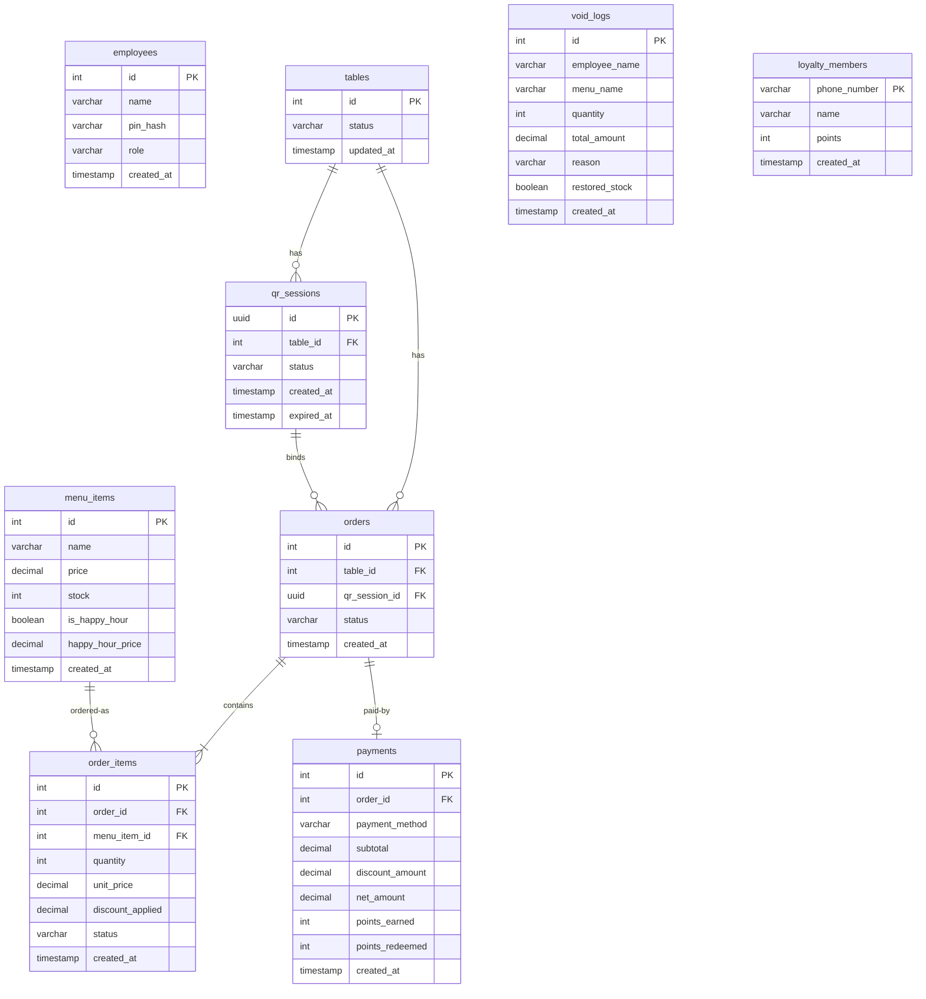

# Database Schema Specification: Yokayaki Izakaya POS

เอกสารแสดงโครงสร้างและผังความสัมพันธ์ตารางข้อมูล (Database Schema & Entity Relationships) ทั้งหมดของระบบ Yokayaki Izakaya POS เพื่อป้องกันข้อผิดพลาดในการพัฒนา และกำหนดความเชื่อมโยงของระบบสต็อก การสั่งซื้อ การยกเลิกออเดอร์ บัญชีสมาชิก และระบบเก็บเงิน

---

## 1. ผังความสัมพันธ์ฐานข้อมูล (Entity Relationship Diagram)

---

## 2. รายละเอียดสเปกตารางข้อมูล (Table Specifications)

### 2.1 ตาราง `employees` (พนักงาน & สิทธิ์เข้าถึง)
*   **คำอธิบาย:** เก็บข้อมูลรายชื่อ รหัส PIN ยืนยันสิทธิ์ของเจ้าของร้านและพนักงาน
*   **โครงสร้าง:**
    *   `id` (SERIAL, Primary Key): รหัสเฉพาะของพนักงาน
    *   `name` (VARCHAR(100)): ชื่อพนักงาน
    *   `pin_hash` (VARCHAR(255)): รหัส PIN 6 หลักที่เข้ารหัสผ่านอัลกอริทึม SHA-256
    *   `role` (VARCHAR(20)): สิทธิ์ผู้ใช้งาน (`owner` หรือ `staff`)
    *   `created_at` (TIMESTAMPTZ)

### 2.2 ตาราง `tables` (ผังโต๊ะอาหาร)
*   **คำอธิบาย:** สถานะของโต๊ะในร้าน (โต๊ะ 1, 2, 3, 4)
*   **โครงสร้าง:**
    *   `id` (INT, Primary Key): เลขที่โต๊ะ
    *   `status` (VARCHAR(20)): สถานะปัจจุบัน (`vacant` / `occupied` / `checking_out`)
    *   `updated_at` (TIMESTAMPTZ)

### 2.3 ตาราง `qr_sessions` (คิวอาร์สแกนสั่งอาหารของลูกค้า)
*   **คำอธิบาย:** จัดเก็บ Token Dynamic QR Code ประจำโต๊ะที่สร้างใหม่ทุกรอบเพื่อความปลอดภัย ป้องกันลูกค้านำรูปถ่าย QR เก่าไปสั่งอาหารนอกร้าน
*   **โครงสร้าง:**
    *   `id` (UUID, Primary Key): คีย์ที่ใช้เป็น URL dynamic บนเว็บแอป
    *   `table_id` (INT, Foreign Key references `tables.id`)
    *   `status` (VARCHAR(20)): สถานะเซสชัน (`active` / `expired`)
    *   `created_at` (TIMESTAMPTZ)
    *   `expired_at` (TIMESTAMPTZ): เวลาหมดอายุเซสชัน (ทำลายอัตโนมัติเมื่อกดชำระเงินสำเร็จ)

### 2.4 ตาราง `menu_items` (รายการอาหาร & เครื่องดื่ม)
*   **คำอธิบาย:** ข้อมูลเมนู ราคา และระบบสต็อกรายจาน
*   **โครงสร้าง:**
    *   `id` (SERIAL, Primary Key)
    *   `name` (VARCHAR(100)): ชื่อเมนู
    *   `price` (DECIMAL(10,2)): ราคาขายปกติ
    *   `stock` (INT): จำนวนสต็อกที่เหลือพร้อมขาย (ลดลงเมื่อสั่ง เพิ่มขึ้นเมื่อยกเลิกแบบคีย์ผิด)
    *   `is_happy_hour` (BOOLEAN): เปิดราคาโปรโมชันหรือไม่
    *   `happy_hour_price` (DECIMAL(10,2)): ราคาขายกรณีอยู่ในโปรโมชัน Happy Hour
    *   `created_at` (TIMESTAMPTZ)

### 2.5 ตาราง `orders` (ออเดอร์หลักประจำบิลโต๊ะ)
*   **คำอธิบาย:** บิลหลักของโต๊ะที่เปิดค้างอยู่
*   **โครงสร้าง:**
    *   `id` (SERIAL, Primary Key)
    *   `table_id` (INT, Foreign Key references `tables.id`)
    *   `qr_session_id` (UUID, Foreign Key references `qr_sessions.id` - มีค่าเฉพาะกรณีลูกค้าแสกนสั่งเอง)
    *   `status` (VARCHAR(20)): สถานะออเดอร์ (`active` = ทานอยู่ / `completed` = จ่ายเงินแล้ว / `voided` = ยกเลิกบิล)
    *   `created_at` (TIMESTAMPTZ)

### 2.6 ตาราง `order_items` (รายการย่อยของออเดอร์)
*   **คำอธิบาย:** เมนูอาหารย่อยแต่ละจานที่สั่งเข้ามาในบิลนั้นๆ
*   **โครงสร้าง:**
    *   `id` (SERIAL, Primary Key)
    *   `order_id` (INT, Foreign Key references `orders.id`)
    *   `menu_item_id` (INT, Foreign Key references `menu_items.id`)
    *   `quantity` (INT): จำนวนจานที่สั่ง
    *   `unit_price` (DECIMAL(10,2)): ราคาที่ซื้อ ณ ช่วงเวลานั้น (เช่น ราคาโปรโมชัน Happy Hour หรือราคาปกติ)
    *   `discount_applied` (DECIMAL(10,2)): ส่วนลดของสินค้าแต่ละหน่วย (หากมี)
    *   `status` (VARCHAR(20)): สถานะการเสิร์ฟ (`pending` / `served` / `voided`)
    *   `created_at` (TIMESTAMPTZ)

### 2.7 ตาราง `void_logs` (รายงานบันทึกประวัติการยกเลิกอาหาร)
*   **คำอธิบาย:** ประวัติเก็บข้อมูลทุกครั้งที่มีการยกเลิกอาหารเพื่อป้องกันเงินรั่วไหล
*   **โครงสร้าง:**
    *   `id` (SERIAL, Primary Key)
    *   `employee_name` (VARCHAR(100)): ชื่อพนักงานผู้ล็อกอินและกดคำสั่ง Void
    *   `menu_name` (VARCHAR(100)): ชื่อรายการอาหารที่ถูกลบ
    *   `quantity` (INT): จำนวนที่ลบ
    *   `total_amount` (DECIMAL(10,2)): มูลค่าเสียหายรวม
    *   `reason` (VARCHAR(255)): เหตุผลการลบ (`คีย์ออเดอร์ผิดพลาด` / `อาหารตกหล่นชำรุด` / อื่นๆ)
    *   `restored_stock` (BOOLEAN): ระบบเอาของกลับคืนสต็อกอัตโนมัติหรือไม่ (คืนเฉพาะกรณีคีย์ผิด)
    *   `created_at` (TIMESTAMPTZ)

### 2.8 ตาราง `loyalty_members` (ฐานข้อมูลสมาชิกร้าน)
*   **คำอธิบาย:** ข้อมูลการสะสมแต้มของลูกค้าประจำเป็นรายบุคคล
*   **โครงสร้าง:**
    *   `phone_number` (VARCHAR(10), Primary Key): เบอร์โทรศัพท์ 10 หลัก (ใช้ค้นหาด่วน)
    *   `name` (VARCHAR(100)): ชื่อสมาชิก
    *   `points` (INT): แต้มคงเหลือสะสม (สะสมเมื่อจ่าย แลกแต้มเพื่อหักส่วนลด)
    *   `created_at` (TIMESTAMPTZ)

### 2.9 ตาราง `payments` (ประวัติการชำระเงินปิดบิล)
*   **คำอธิบาย:** ยอดการจ่ายเงินจริงทุกบิลหลังลูกค้าทำรายการเช็คบิลเรียบร้อยแล้ว
*   **โครงสร้าง:**
    *   `id` (SERIAL, Primary Key)
    *   `order_id` (INT, Foreign Key references `orders.id`)
    *   `payment_method` (VARCHAR(20)): ช่องทางชำระเงิน (`cash` = เงินสด / `promptpay` = โอน / `mixed` = ผสม)
    *   `subtotal` (DECIMAL(10,2)): ยอดราคารวมอาหารทั้งหมดก่อนหักส่วนลด
    *   `discount_amount` (DECIMAL(10,2)): ส่วนลดสะสมรวมทั้งหมด (ส่วนลดสมาชิก/โปรโมชัน)
    *   `net_amount` (DECIMAL(10,2)): ยอดเงินจริงที่รับเข้ามาในระบบบัญชี
    *   `points_earned` (INT): แต้มที่ได้รับเพิ่มจากบิลนี้ (คิดจาก net_amount ทุกๆ 25 บาท = 1 แต้ม)
    *   `points_redeemed` (INT): แต้มสะสมที่ใช้แลกส่วนลดในบิลนี้
    *   `created_at` (TIMESTAMPTZ)
