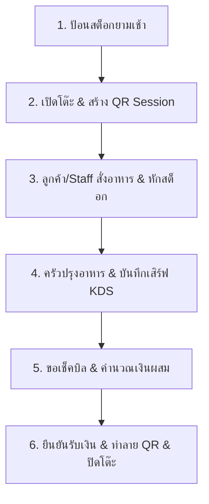
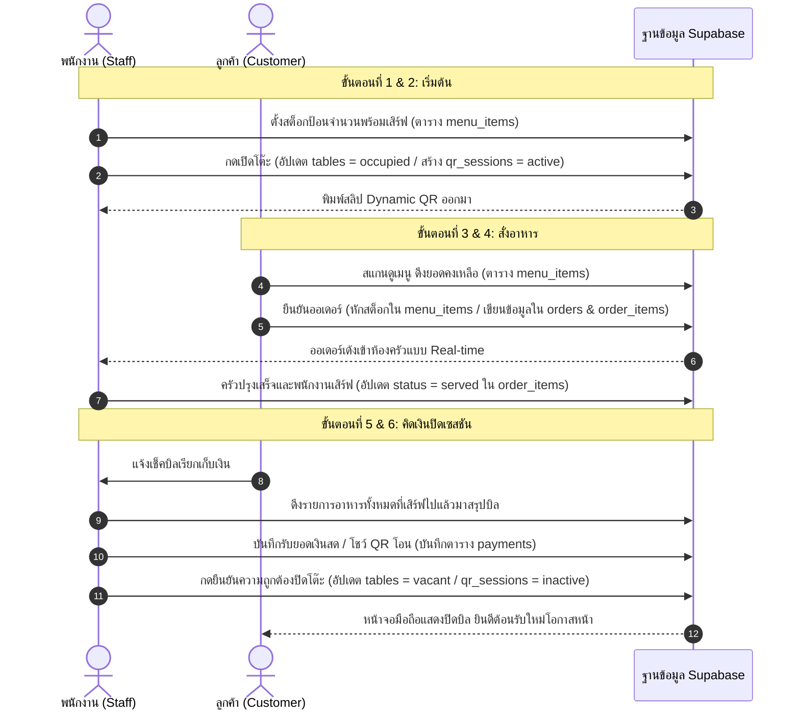

# Specification: End-to-End Operational Workflow (operational-workflow.md)

เอกสารอธิบายลำดับขั้นตอนการทำงาน (Workflow) ตั้งแต่เริ่มเปิดร้านจนถึงปิดบิลชำระเงิน พร้อมรายละเอียดการเขียน/อัปเดตข้อมูลในฐานข้อมูลแต่ละสเต็ป เพื่อใช้เป็นแนวทางในการวาดแผนภาพระบบ (System Diagram)

---

## 🎨 ภาพรวมขั้นตอนการทำงาน (Workflow Flowchart)



---

## 1. รายละเอียดของแต่ละขั้นตอน (Detailed Step-by-Step)

### ขั้นตอนที่ 1: การป้อนข้อมูลสต็อกก่อนเปิดร้าน (Morning Prep Setup)
*   **🏃 หน้างานจริง:** พนักงานครัวนับวัตถุดิบจำกัด ➡️ พนักงานหน้าร้านกดเลือกเมนูบนหน้าจอ POS สต็อก ➡️ ป้อนยอดจำนวนจานพร้อมขายประจำเป็นวัน
*   **⚙️ หลังบ้านระบบ (DB Action):**
    *   ระบบทำการอัปเดตค่าของตาราง `menu_items`
    *   ฟิลด์ที่อัปเดต: `current_stock` (จำนวนจาน), `is_stock_tracked` (เปิดใช้เป็น TRUE)
*   **📊 ตัวอย่างข้อมูลใน DB:**
    ```json
    {
      "menu_item_id": "M001",
      "name_th": "แก้มปลาต้มซีอิ๊ว",
      "current_stock": 5,
      "is_stock_tracked": true,
      "price_regular": 120.00
    }
    ```

---

### ขั้นตอนที่ 2: การเปิดโต๊ะและสร้างเซสชัน (Open Table & Session Creation)
*   **🏃 หน้างานจริง:** ลูกค้าเดินเข้าร้าน ➡️ พนักงานจิ้มเปิดโต๊ะบนผัง POS (เช่น โต๊ะ 3) ➡️ เครื่องพิมพ์พิมพ์สลิป Dynamic QR ออกมา ➡️ พนักงานนำไปส่งให้ลูกค้าสแกนสั่งเองที่โต๊ะ
*   **⚙️ หลังบ้านระบบ (DB Action):**
    1.  อัปเดตสถานะตาราง `tables` ของโต๊ะ 3 ➡️ `status = 'occupied'` (ไม่ว่าง)
    2.  เพิ่มข้อมูลแถวใหม่ (Insert Row) ในตาราง `qr_sessions`
        *   บันทึก: `id` (รหัสเซสชันแบบสุ่มเดาไม่ได้), `table_id = 3`, `status = 'active'`, `created_at = NOW()`
*   **📊 ตัวอย่างข้อมูลใน DB (`qr_sessions`):**
    ```json
    {
      "session_id": "qs_xyz789_tb3",
      "table_id": 3,
      "status": "active",
      "created_at": "2026-07-05 17:00:00"
    }
    ```

---

### ขั้นตอนที่ 3: การรับออเดอร์และการหักสต็อก (Order Placement & Stock Deduction)
*   **🏃 หน้างานจริง:** ลูกค้าสแกน QR ผ่านมือถือ ➡️ เลือกสินค้า (ถ้าสต็อกเหลือ 1-3 โชว์ป้ายสีส้ม หากเหลือ 0 ปุ่มจะเทาและสั่งไม่ได้) ➡️ กดยืนยันสั่งออเดอร์
*   **⚙️ หลังบ้านระบบ (DB Action - ทำแบบ Transaction ป้องกันออเดอร์ชนกัน):**
    1.  ตรวจสอบว่า `qr_sessions` ของเครื่องลูกค้ายังมีสถานะเป็น `'active'` หรือไม่
    2.  ตรวจสอบและหักยอดสต็อกเมนูที่จำกัดในตาราง `menu_items` ➡️ `current_stock = current_stock - จำนวนที่สั่ง` (ถ้าผลลัพธ์น้อยกว่า 0 ระบบจะแจ้งหมดและม้วนกลับการทำงาน)
    3.  เพิ่มรายการในตาราง `orders` ➡️ ตั้งค่า `id` และสถานะเริ่มต้น `status = 'cooking'`
    4.  เพิ่มรายการในตาราง `order_items` ➡️ บันทึกราคาที่สั่ง ณ เสี้ยววินาทีนั้นลงฟิลด์ `price_at_order` เพื่อป้องกันราคาขัดแย้งหากหมดช่วง Happy Hour ตอนจ่ายเงิน
    5.  ส่ง Notification แบบเรียลไทม์ (Supabase Realtime) ไปอัปเดตที่จอ POS หน้าร้าน
*   **📊 ตัวอย่างข้อมูลใน DB (`order_items`):**
    ```json
    {
      "order_item_id": "OI001",
      "order_id": "ORD-101",
      "menu_item_id": "M001", // แก้มปลาต้มซีอิ๊ว
      "quantity": 2,
      "price_at_order": 120.00, // ราคา ณ ตอนกดสั่งซื้อจริง
      "status": "cooking" // กำลังทำ
    }
    ```

---

### ขั้นตอนที่ 4: การปรุงอาหารและส่งสัญญาณเสิร์ฟ (Cooking & Serving)
*   **🏃 หน้างานจริง:** ห้องครัวปรุงอาหารเสร็จ ➡️ พนักงานหน้าร้านนำอาหารไปเสิร์ฟที่โต๊ะ 3 ➡️ พนักงานจิ้มปุ่ม "เสิร์ฟแล้ว" บนหน้าจอระบบเพื่อเคลียร์รายการอาหารออกจากคิว
*   **⚙️ หลังบ้านระบบ (DB Action):**
    *   ระบบทำการอัปเดตสถานะของไอเทมนั้นในตาราง `order_items`
    *   ฟิลด์ที่อัปเดต: เปลี่ยน `status = 'served'` และบันทึกเวลา `served_at = NOW()`
*   **📊 ตัวอย่างข้อมูลใน DB (`order_items`):**
    ```json
    {
      "order_item_id": "OI001",
      "status": "served",
      "served_at": "2026-07-05 17:25:00"
    }
    ```

---

### ขั้นตอนที่ 5: การขอเช็คบิลและหน้าต่าง Multi-Payment (Checkout Stage)
*   **🏃 หน้างานจริง:** ลูกค้าเรียกเช็คบิล ➡️ โต๊ะเปลี่ยนเป็นสีเหลืองบน POS ➡️ พนักงานเปิดหน้าคำนวณบิล ➡️ เลือกช่องทางจ่ายผสม เช่น กรอกเงินสด 200 โอน 300 ➡️ ระบบคำนวณเงินค้างและแสดง Dynamic QR 300 บาทบนเครื่อง POS
*   **⚙️ หลังบ้านระบบ (DB Action):**
    1.  ดึงประวัติรายการทั้งหมดที่มีค่า `status = 'served'` ในออเดอร์ของโต๊ะนั้นขึ้นมาคำนวณยอดเงินรวม (Gross Total)
    2.  ดึงสิทธิ์และแต้มสมาชิก (หากลูกค้าต้องการสะสม/แลกแต้ม) เพื่อหักลดหย่อนยอดเงิน
    3.  ปรับสถานะของโต๊ะในตาราง `tables` ➡️ `status = 'checking_out'`
*   **📊 ตัวอย่างข้อมูลยอดรวมบนหน้าจอ:**
    *   ยอดรวมดิบ: `500 บาท`
    *   ยอดหักเงินสดรับ: `200 บาท`
    *   **ยอดค้างโอนผ่านพร้อมเพย์: `300 บาท` ➡️ สร้างคิวอาร์ Dynamic ยอด 300 บาทด่วน**

---

### ขั้นตอนที่ 6: การยืนยันชำระเงินและจบธุรกรรม (Confirm & Close Session)
*   **🏃 หน้างานจริง:** ลูกค้าสแกนโอนเงิน 300 บาทสำเร็จ ➡️ พนักงานตรวจสอบสลิปแล้วกด "ยืนยันรับชำระเงิน" ➡️ เครื่อง POS พิมพ์ใบเสร็จดิจิทัล ➡️ ลูกค้าออกจากร้าน
*   **⚙️ หลังบ้านระบบ (DB Action):**
    1.  บันทึกข้อมูลธุรกรรมลงตาราง `payments`
        *   เก็บบันทึก: `cash_amount = 200`, `transfer_amount = 300`, `total_amount = 500`, `payment_method = 'MIXED'`
    2.  หากลูกค้าเป็นสมาชิก ➡️ ทำการเพิ่มแต้มใหม่และหักลบแต้มสะสมเดิมในประวัติสมาชิก
    3.  ทำลายคิวอาร์ในตาราง `qr_sessions` ➡️ อัปเดต `status = 'inactive'` และ `ended_at = NOW()`
    4.  เคลียร์โต๊ะกลับมาว่างในตาราง `tables` ➡️ อัปเดต `status = 'vacant'`
*   **📊 ตัวอย่างข้อมูลใน DB (`payments`):**
    ```json
    {
      "payment_id": "P_099",
      "order_id": "ORD-101",
      "cash_amount": 200.00,
      "transfer_amount": 300.00,
      "total_amount": 500.00,
      "status": "success",
      "created_at": "2026-07-05 18:00:00"
    }
    ```

---

## 2. ลำดับเหตุการณ์และทิศทางของข้อมูล (Sequence Diagram)

เพื่อช่วยให้พีพีเอาไปทำภาพได้ง่ายขึ้น นี่คือ **Sequence Diagram** ของข้อมูลไหลเข้า-ออกตารางแต่ละตารางในฐานข้อมูลค่ะ:


