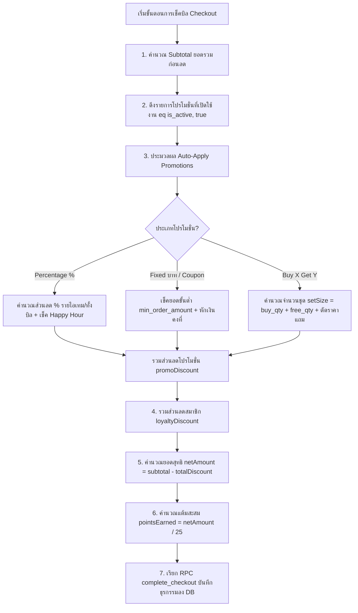

# 🏷️ Yokayaki POS — เอกสารระบบโปรโมชั่น & คูปองส่วนลด (Promotion & Discount System)

> **เอกสารคู่มือ ข้อกำหนดทางเทคนิค ลอจิกการคำนวณ และ Workflow ระบบโปรโมชั่น**  
> ปรับปรุงล่าสุด: 8 สิงหาคม 2026

---

## 📌 1. ภาพรวมระบบ (System Overview)

ระบบโปรโมชั่นของ Yokayaki POS ออกแบบมาเพื่อรองรับการส่งเสริมการขายของร้านอาหารและอิซากายะอย่างครอบคลุม ทั้งการลดราคาแบบเปอร์เซ็นต์, ส่วนลดเป็นจำนวนเงินสด, คูปองส่วนลดแบบระบุรหัส, โปรโมชั่นซื้อ X แถม Y และโปรโมชั่นจำกัดช่วงเวลา (Happy Hour) โดยรองรับทั้งการใช้โปรโมชั่นทั้งบิล และโปรโมชั่นเฉพาะรายการอาหาร/เครื่องดื่ม

---

## 🎯 2. ประเภทโปรโมชั่น (Promotion Categories)

การสร้างโปรโมชั่นในระบบแบ่งออกเป็น **3 ประเภทหลัก** ผ่าน Modal จัดการโปรโมชั่นแบบ 3-Column Card Selector:

### 2.1 🏷️ ส่วนลด (Discount)
*   **คำอธิบาย:** การลดราคาปกติของบิล หรือลดเฉพาะรายการอาหารที่กำหนด
*   **รูปแบบส่วนลด:**
    *   `เปอร์เซ็นต์ (%)`: เช่น ลด 10%, ลด 20%
    *   `จำนวนเงิน (บาท)`: เช่น ลด 50 บาท, ลด 100 บาท
*   **เงื่อนไขเพิ่มเติม:**
    *   กำหนด **ยอดสั่งซื้อขั้นต่ำ** (เช่น ต้องสั่งครบ 500 บาทขึ้นไป)
    *   กำหนด **เมนูที่ร่วมรายการ** (ระบุเฉพาะเมนู หรือใช้ได้กับทุกเมนูทั้งบิล)
    *   กำหนด **ช่วงเวลา Happy Hour** (เช่น 17:00 - 19:00 น.)

### 2.2 🎟️ คูปองส่วนลด (Coupon Code)
*   **คำอธิบาย:** คูปองที่ต้องกรอกรหัสตัวอักษรเพื่อรับส่วนลด (เช่น `YOKA50`, `GRANDOPEN`)
*   **รูปแบบส่วนลด:** เลือกได้ทั้ง `%` หรือ `บาท`
*   **คุณสมบัติ:**
    *   รหัสคูปองเป็นตัวอักษรพิมพ์ใหญ่ภาษาอังกฤษ (Font-Mono Uppercase)
    *   กำหนด **ยอดสั่งซื้อขั้นต่ำ** และ **เมนูที่ร่วมรายการ** ได้

### 2.3 🎁 ซื้อ X แถม Y (Buy X Get Y)
*   **คำอธิบาย:** ซื้อเมนูที่กำหนดครบจำนวน X จาน/แก้ว รับฟรีเมนูเดียวกันหรือรายการที่กำหนดจำนวน Y จาน/แก้ว
*   **ตัวอย่าง:** ซื้อยากิโทริสะโพกไก่ 2 จาน แถมฟรี 1 จาน (`ซื้อ 2 แถม 1`)
*   **เงื่อนไข:**
    *   **ต้องเลือกเมนูที่จัดโปรโมชั่น** (Target Menu Item)
    *   ระบุจำนวนซื้อ (Buy Quantity) และจำนวนแถม (Free Quantity)
    *   สามารถกำหนดช่วงเวลา Happy Hour เพิ่มเติมได้

---

## 🧮 3. ลอจิกการคำนวณและขั้นตอน Workflow (Calculation Logic & Workflow Algorithms)

### 3.1 Checkout Workflow (ขั้นตอนการประมวลผลส่วนลด ณ หน้าคิดเงิน)



---

### 3.2 สูตรและลอจิกการคำนวณส่วนลด (Discount Calculation Formulas)

#### 1) สูตรคำนวณส่วนลดเปอร์เซ็นต์ (Percentage Discount Algorithm)
*   **กรณีส่วนลดทั้งร้าน (All Menu):**
    $$\text{discountValue} = \text{Math.round}\left(\frac{\text{subtotal} \times \text{discount\_percent}}{100}\right)$$
*   **กรณีส่วนลดเฉพาะเมนู หรือช่วงเวลา Happy Hour:**
    *   วนลูปตรวจสอบรายการสินค้าที่ไม่ถูกยกเลิก (`status !== 'voided'`)
    *   ตรวจสอบเงื่อนไขเมนูเฉพาะ: `item.menu_item_id === promo.menu_item_id`
    *   ตรวจสอบเวลาสั่งซื้อ (`item.created_at` ในรูปแบบ `HH:mm`):
        $$\text{promo.start\_time} \le \text{itemTimeStr} < \text{promo.end\_time}$$
    *   สูตรหักส่วนลดต่อไอเทม:
        $$\text{itemDiscount} = \text{Math.round}\left(\frac{\text{item.quantity} \times \text{item.unit\_price} \times \text{discount\_percent}}{100}\right)$$

#### 2) สูตรคำนวณส่วนลดเงินสด / คูปอง (Fixed Amount & Coupon Algorithm)
*   **เงื่อนไขยึดถือยอดขั้นต่ำ:**
    $$\text{subtotal} \ge \text{min\_order\_amount}$$
*   **คำนวณส่วนลด:**
    $$\text{discountValue} = \text{discount\_amount}$$

#### 3) สูตรคำนวณซื้อ X แถม Y (Buy X Get Y Algorithm)
*   **ขนาดต่อชุดโปรโมชั่น (Set Size):**
    $$\text{setSize} = \text{buy\_qty} + \text{free\_qty}$$
*   **จำนวนชุดโปรโมชั่นที่ครบเงื่อนไข (Completed Sets):**
    $$\text{completedSets} = \left\lfloor \frac{\text{totalItemQuantity}}{\text{setSize}} \right\rfloor$$
*   **จำนวนรายการที่ได้รับแถมฟรี (Free Items Quantity):**
    $$\text{freeQuantity} = \text{completedSets} \times \text{free\_qty}$$
*   **มูลค่าส่วนลดรวมของการแถมฟรี (Total Discount Value):**
    $$\text{discountValue} = \text{freeQuantity} \times \text{unit\_price}$$

---

## ⏰ 4. กฎโปรโมชั่น Happy Hour และการล็อกราคา (Order-Time Price Lock)

1.  **การแสดงผลหน้าเมนู (Client & POS Display):**
    *   เมื่ออยู่ในช่วงเวลา Happy Hour (เช่น 17:00 - 19:00 น.) เมนูที่จัดโปรจะแสดงราคาโปรโมชั่นสีเด่นชัด พร้อมขีดฆ่าราคาปกติ เช่น `~~90~~` ➡️ **50 THB**
2.  **การบันทึกออเดอร์และการล็อกราคา (Price Lock):**
    *   เมื่อสั่งซื้อ ออเดอร์จะบันทึกราคา ณ เสี้ยววินาทีที่กดสั่งเข้าฟิลด์ `order_items.price_at_order`
    *   **ยอดเงินจะถูกล็อกคงที่** แม้ลูกค้าจะเช็คบิลพ้นช่วงเวลา Happy Hour ไปแล้วก็ตาม

---

## 🗄️ 5. โครงสร้างฐานข้อมูล (Database Schema)

### 5.1 ตาราง `promotions`

| ฟิลด์ | ประเภท | คำอธิบาย |
|---|---|---|
| `id` | `BIGINT (PK)` | รหัสไอดีโปรโมชั่น |
| `name` | `TEXT` | ชื่อโปรโมชั่น (เช่น "ลด 20% ฉลองเปิดร้าน") |
| `type` | `VARCHAR` | ประเภทส่วนลด (`percentage`, `fixed`, `buy_x_get_y`) |
| `discount_percent` | `NUMERIC` | เปอร์เซ็นต์ส่วนลด (ถ้ามี) |
| `discount_amount` | `NUMERIC` | จำนวนเงินส่วนลด (บาท) (ถ้ามี) |
| `min_order_amount` | `NUMERIC` | ยอดสั่งซื้อขั้นต่ำ (บาท) (Default: `0`) |
| `buy_qty` | `INT` | จำนวนซื้อ (สำหรับ Buy X Get Y) |
| `free_qty` | `INT` | จำนวนแถม (สำหรับ Buy X Get Y) |
| `menu_item_id` | `BIGINT (FK)` | เมนูเฉพาะที่จัดโปร (ถ้ามี, Ref: `menu_items.id`) |
| `coupon_code` | `VARCHAR` | รหัสคูปอง (ถ้ามี, e.g. `YOKA50`) |
| `start_time` | `TIME` | เวลาเริ่มต้น Happy Hour (e.g. `17:00:00`) |
| `end_time` | `TIME` | เวลาสิ้นสุด Happy Hour (e.g. `19:00:00`) |
| `is_active` | `BOOLEAN` | สถานะเปิด/ปิดใช้งาน (Default: `true`) |
| `created_at` | `TIMESTAMPTZ` | วันเวลาที่สร้างรายการ |

### 5.2 ตาราง `payment_promotions`

บันทึกประวัติการใช้โปรโมชั่นในแต่ละบิลเมื่อชำระเงินสำเร็จ (Checkout):

| ฟิลด์ | ประเภท | คำอธิบาย |
|---|---|---|
| `id` | `BIGINT (PK)` | รหัสไอดี |
| `payment_id` | `BIGINT (FK)` | อ้างอิงตาราง `payments.id` |
| `promotion_id` | `BIGINT (FK)` | อ้างอิงตาราง `promotions.id` |
| `discount_applied` | `NUMERIC` | จำนวนเงินส่วนลดที่หักจริงในบิล |

---

## ⚙️ 6. ฟังก์ชันประมวลผล (Supabase RPC)

### `complete_checkout`
ปิดบิลชำระเงิน + บันทึกส่วนลด + ตัดแต้มสะสม + บันทึกประวัติโปรโมชั่น:

```sql
complete_checkout(
  p_order_id BIGINT,
  p_payment_method TEXT,
  p_subtotal NUMERIC,
  p_discount_amount NUMERIC,
  p_net_amount NUMERIC,
  p_points_earned INT,
  p_points_redeemed INT,
  p_phone_number TEXT,
  p_applied_promos JSONB -- รายการโปรโมชั่นที่ใช้ในบิลนี้
)
```

---

## 🎨 7. ส่วนต่อประสานผู้ใช้ (User Interface)

*   **หน้าจัดการโปรโมชั่น:** [`components/promo/PromoManager.tsx`](file:///c:/Users/PP/Desktop/React/yokayaki/components/promo/PromoManager.tsx)
*   **ดีไซน์การ์ดโปรโมชั่น:**
    *   แสดงปุ่ม **แก้ไข** และ **ลบ** เหนือเส้นแบ่งขอบล่าง
    *   Badge บอกประเภทโปรโมชั่นสีสันชัดเจน (Rose = ส่วนลด %, Amber = คูปอง, Indigo = ซื้อแถม)
    *   จุด Pulse ไฟเขียวเรืองแสงบอกสถานะเปิดใช้งาน
*   **Modal สร้าง/แก้ไขโปรโมชั่น:**
    *   Grid-3 Selector ปุ่มเลือกประเภทใช้งานง่าย
    *   ฟิลด์อินพุตเปลี่ยนตามประเภทอัตโนมัติ
    *   สวิตช์เปิด/ปิด Happy Hour แบบ Toggle สวยงาม
